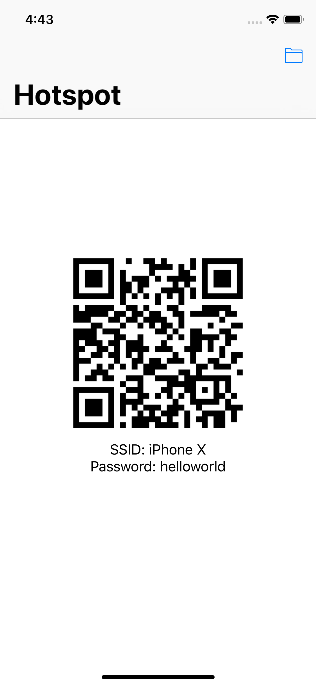

## What?

An easy way to share your hotspot of your iPhone to others. No typing requried, just scanning the QR code.

## How?

1. Input your password of your hotspot on your first opening the app. You can update the password at anytime in case changing the password.
2. App will generate an QR code for your Hotspot once password provided.
3. Make sure turn on hotsopt in Settings app.
3. Show the QR code to anyone you want to share with. They can connect to the hotspot by scanning via Camera app now.

## Screenshot

